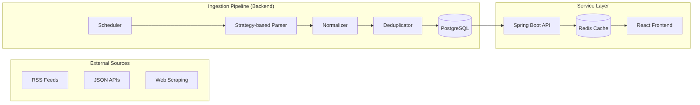

# TechMoa (테크모아) 🚀

> **"파편화된 기술 지식을 한곳에, 개발자를 위한 테크 블로그 큐레이션 플랫폼"**

TechMoa는 국내외 주요 기업 및 개인 테크 블로그의 양질의 콘텐츠를 자동으로 수집하여, 개발자들이 최신 기술 트렌드를 놓치지 않고 탐색할 수 있도록 돕는 서비스입니다.

---

## 🏗 System Architecture

본 프로젝트는 **확장성**과 **데이터 정규화**를 최우선으로 설계되었습니다.

### 1. High-Level Flow


### 2. Ingestion Pipeline Strategy
- **Strategy Pattern**: 소스 타입(RSS, JSON, Scraper)에 따른 파서를 전략 패턴으로 구현하여, 새로운 수집 대상 추가 시 기존 코드 수정 없이 확장 가능합니다.
- **Normalization**: 서로 다른 데이터 포맷을 `ParsedPost` 표준 규격으로 정규화하여 데이터 품질을 유지합니다.
- **Deduplication**: `canonical_url` 기반의 Upsert 로직을 통해 데이터 중복을 방지하고 최신 상태를 유지합니다.

---

## 🛠 Tech Stack

### Backend
- **Language/Framework**: Java 21, Spring Boot 3.4
- **Database**: PostgreSQL 16 (Main), Redis 7 (Cache)
- **ORM/Migration**: Spring Data JPA, Flyway
- **Test**: JUnit 5, AssertJ, Mockito

### Frontend
- **Framework**: React 18 (TypeScript), Vite
- **State/API**: Axios, React Router
- **Style**: Vanilla CSS (Modern CSS features)

### Infra/DevOps
- **Container**: Docker, Docker Compose
- **CI/CD**: GitHub Actions (Planned)

---

## 💎 Key Technical Decisions

### 1. 데이터 수집의 안정성 (Fault Tolerance)
- 특정 블로그의 RSS가 응답하지 않더라도 전체 파이프라인에 영향이 가지 않도록 **소스별 실패 격리**를 적용했습니다.
- `sync_jobs` 테이블을 통해 각 수집 작업의 성공/실패 이력과 에러 로그를 기록하여 운영 가시성을 확보했습니다.

### 2. 조회 성능 최적화
- **DB Indexing**: 게시글 목록 조회 성능을 위해 `published_at` 역순 인덱스와 `source_id` 복합 인덱스를 설계했습니다.
- **Caching Strategy**: 빈번하게 조회되는 최신 게시글 피드에 Redis 캐시를 적용하여 DB 부하를 줄이고 응답 속도를 개선했습니다 (목표 p95 300ms).

### 3. 클린 아키텍처 지향
- 도메인 중심의 패키지 구조(`source`, `post`, `ingestion`, `tag`)를 채택하여 각 도메인의 책임과 역할을 명확히 분리했습니다.

---

## 📊 Database Schema (ERD)

핵심 테이블 간의 관계와 중복 제거 전략입니다. 자세한 내용은 [ERD 상세 문서](./docs/ERD.md)를 참고하세요.

- **Sources (1:N) Posts**: 수집 대상과 수집된 글의 관계
- **Posts (N:M) Tags**: 게시글과 기술 태그 간의 다대다 관계 (매핑 테이블 활용)
- **Sources (1:N) SyncJobs**: 수집 이력 관리 및 모니터링

---

## 🚀 Quick Start

### Prerequisites
- Docker & Docker Compose

### Step-by-Step
1. **인프라 실행**:
   ```bash
   docker-compose up -d postgres redis
   ```
2. **백엔드 실행**:
   ```bash
   cd backend && ./gradlew bootRun
   ```
3. **프론트엔드 실행**:
   ```bash
   cd frontend && npm install && npm run dev
   ```

---

## 📂 Documentation
- [System Architecture 상세](./docs/ARCHITECTURE.md)
- [API Specification](./docs/API_SPEC.md)
- [Ingestion Playbook](./docs/INGESTION_PLAYBOOK.md)
- [Project Log & Checklist](./docs/TECHMOA_PROJECT_LOG.md)
