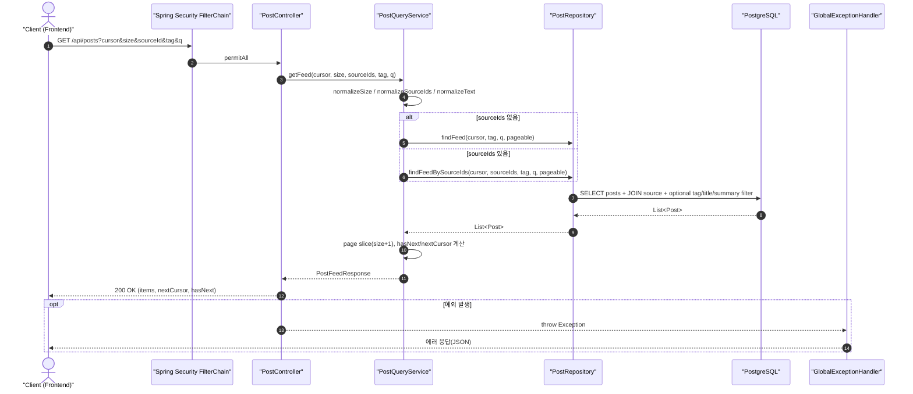
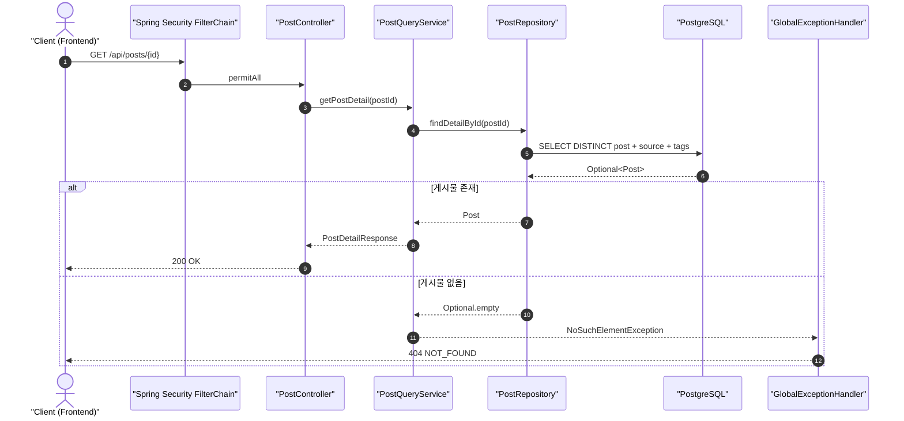
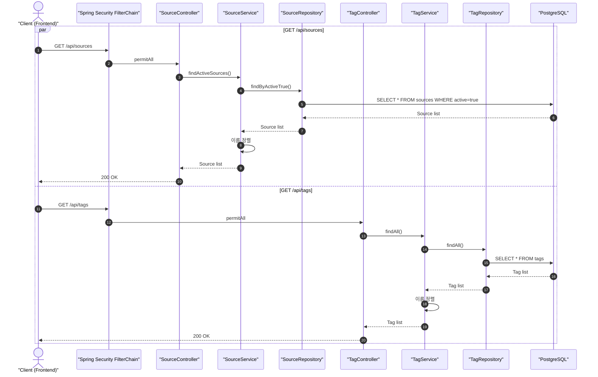
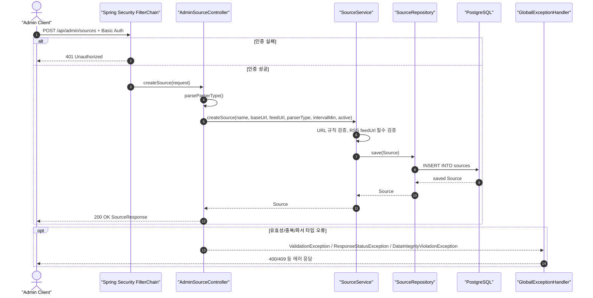
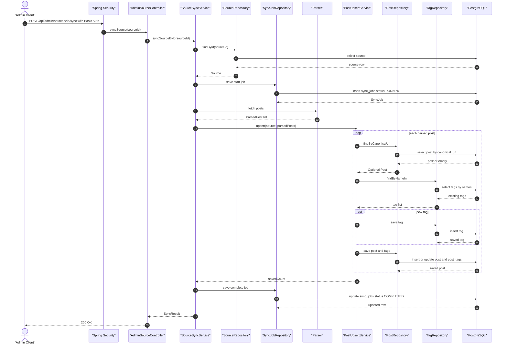
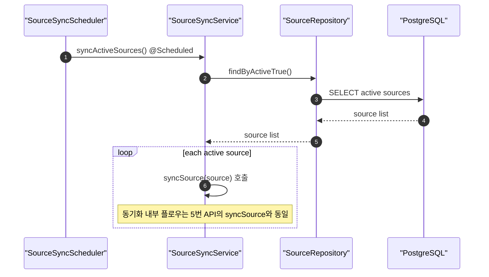
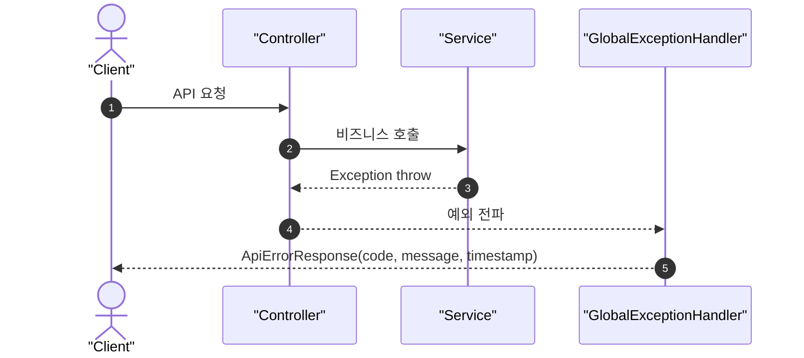

# Backend Sequence Diagram

기준: 현재 `main` 브랜치 코드(2026-02-21)

## 1. `GET /api/posts` (목록/검색/다중 소스 OR 필터)

## 2. `GET /api/posts/{id}` (상세)

## 3. `GET /api/sources`, `GET /api/tags`

## 4. `POST /api/admin/sources` (관리자 소스 등록)

## 5. `POST /api/admin/sources/{id}/sync` (관리자 수동 동기화)

## 6. 내부 수집 트리거 (스케줄러)

## 7. 예외 응답 흐름 (공통)

